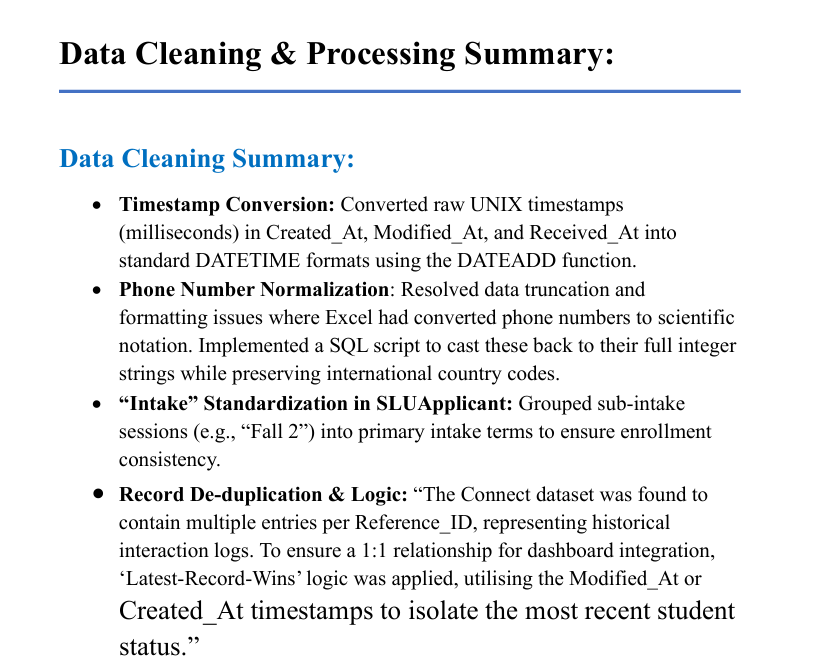

# Week 1 Deliverables 🚀

## 📌 Project Overview
This project focuses on understanding dataset structure, cleaning data, and integrating multiple datasets into a relational database system.

---

## 📊 Dataset Details
- Applicant Dataset: Student eligibility & financial data  
- Connect Dataset: Workflow & document tracking  
- SEVIS Dataset: Immigration & compliance records  

---

## 🧹 Data Cleaning & Processing
- Converted UNIX timestamps into readable format  
- Fixed phone number formatting issues  
- Standardized intake values  
- Removed duplicates and handled missing values  

---

## 🔗 Data Integration
- Linked datasets using Reference_ID & SEVIS_ID  
- Applied relational joins  
- Ensured data consistency and integrity  

---

## 📈 Key Observations
- High missing values in some fields  
- Data inconsistencies due to manual entry  
- Strong relational structure achieved after integration  

---

## 📸 Screenshots

### Dataset Understanding

### Data Cleaning

### Data Integration

---

## 📄 Report
Full detailed report available in this folder.
