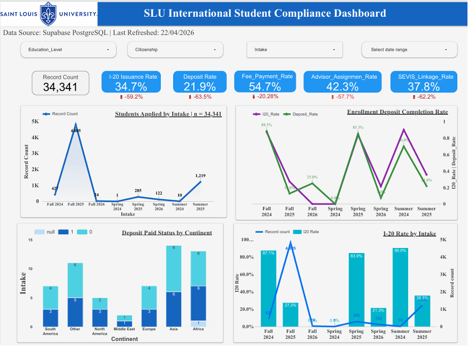
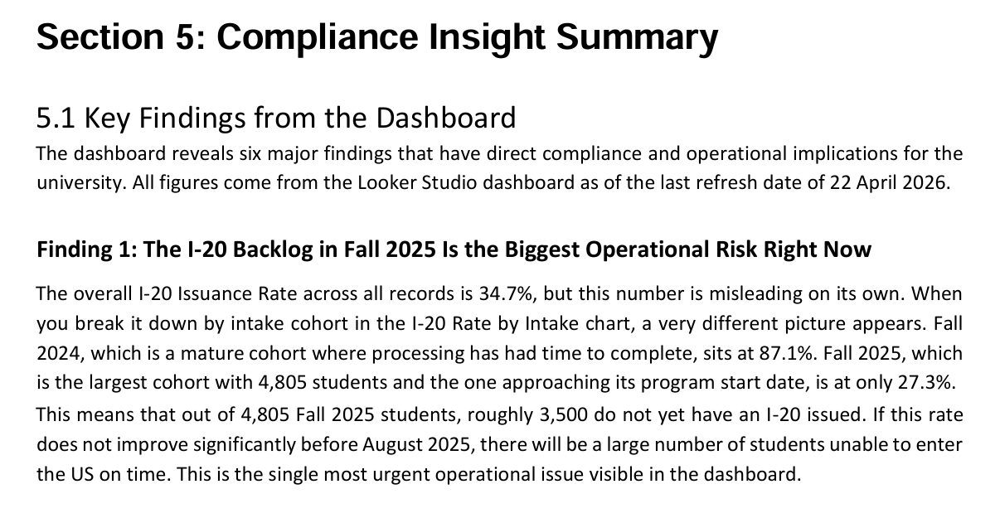
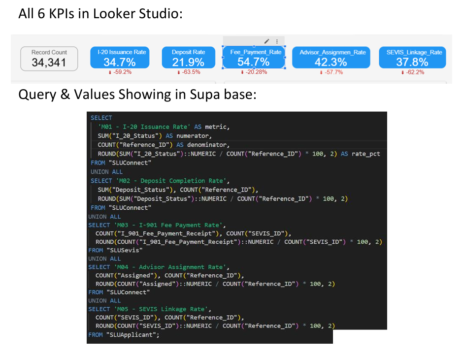
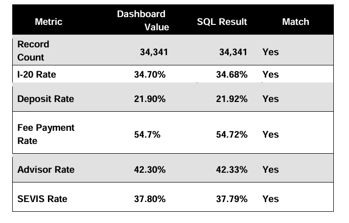

# 📊 Week 3 – Dashboard & SQL Validation

## 🔹 Project Overview
Built a Looker Studio dashboard to track international student compliance pipeline.

## 🔹 Tools Used
- Looker Studio
- SQL
- Supabase

## 🔹 Key Highlights
- 34K+ records analyzed
- KPI validation using SQL queries
- Identified gaps in I-20, deposit & SEVIS process

---

## 📈 Dashboard Preview

---

## 🧠 Key Insights

---

## 💻 SQL Validation

---

## 📊 KPI Validation Summary

---

## 📄 Full Report
[Click here to view report](Week3_Muneeza_Team5.pdf)
